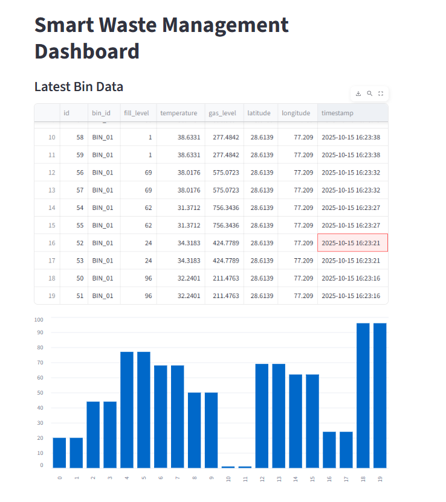

### Overview

The Smart Waste Management System is an AI-driven simulation project designed to demonstrate how IoT-based smart bins can improve urban waste collection.

This project uses virtual sensors, real-time data transmission (MQTT), local data storage (SQLite), and a Streamlit dashboard for visualization — showing how data-driven decisions can optimize waste management in smart cities.

### Objective

To design and implement a Decision Support System (DSS) that:

Simulates smart waste bins using virtual sensors.

Collects, stores, and visualizes real-time waste data.

Helps optimize collection frequency, routes, and monitoring.

### System Architecture

### Flow of Data
Virtual Sensors (Simulator.py)
       ↓  [MQTT Protocol]
Ingestion Service (Ingest_SQLite.py)
       ↓
Local Database (SQLite)
       ↓
Dashboard (Streamlit)

### Components Used

| Component              | Technology Used      | Purpose                                                   |
| -----------------------| -------------------- | --------------------------------------------------------- |
|   **Simulator**        | Python + MQTT (Paho) | Simulates sensor data (fill level, temperature, gas, GPS) |
|  **Database**          | SQLite               | Stores incoming sensor data locally                       |
|  **Ingestion Service** | MQTT Subscriber      | Listens to data and inserts into DB                       |
|  **Dashboard**         | Streamlit            | Visualizes live bin data and analytics                    |
|  **(Optional)**        | OR-Tools             | Route optimization for collection                         |
|  **Broker**            | test.mosquitto.org   | Public MQTT broker for message passing                    |

### Features

Virtual smart bin data generation
Real-time MQTT communication
Automatic data storage in SQLite
Live dashboard with charts and tables
Expandable — add predictions, route planning, or AI logic

### How to Run the Project

### Step 1 — Setup

git clone https://github.com/pedaballiomprakash/Smart_Waste_Management_Micro_Project.git
cd Smart_Waste_Management_System
python -m venv venv
venv\Scripts\activate   # or source venv/bin/activate on Mac/Linux
pip install -r requirements.txt

### Step 2 — Run the Project

Terminal 1 — Run the Data Ingestion Service ----> python ingest_sqlite.py
Terminal 2 — Run the Simulator   ---------------> python simulator.py
Terminal 3 - Run the Dashboard   ---------------> streamlit run dashboard.py

### View Dashboard

Open your browser → http://localhost:8501

### Sample Output

### Example Data Flow:

Sent: {'bin_id': 'BIN_01', 'fill_level': 74, 'temperature': 29.4, 'gas_level': 612, ...}
Received: {'bin_id': 'BIN_01', 'fill_level': 74, ...}

### Dashboard Screenshot:

### Project Structure

Smart_Waste_Management_System/
├── simulator.py          # Generates virtual sensor data
├── ingest_sqlite.py      # Receives MQTT messages and stores in SQLite
├── predict.py            # Predicts bin overflow (optional)
├── optimize.py           # Suggests collection order (optional)
├── dashboard.py          # Streamlit dashboard
├── requirements.txt      # Dependencies
├── data.db               # SQLite database
└── README.md             # Project documentation

### Future Enhancements

Add multiple bins and city-wide map visualization.
Integrate machine learning for overflow prediction.
Implement route optimization for collection trucks.
Add alerts for overfilled or high-temperature bins.
Migrate database to cloud storage (Firebase/AWS).

### Author

Name: Pedaballi Om Prakash Reddy, Ganapathi Sai Abhishek Grandhe, Shaik Afroz
Institution: Alliance University
Department: Artifical Intelligence and Data Science
Project Type: Micro Project
Year: 2025

### Acknowledgements

OpenAI ChatGPT (for development guidance)
Streamlit Community
Eclipse Mosquitto MQTT Broker
Python Software Foundation

### Summary

This project demonstrates how IoT + Data Visualization can be used to make waste collection more efficient and sustainable.
It’s lightweight, works locally, and provides a great learning experience for smart city applications.
